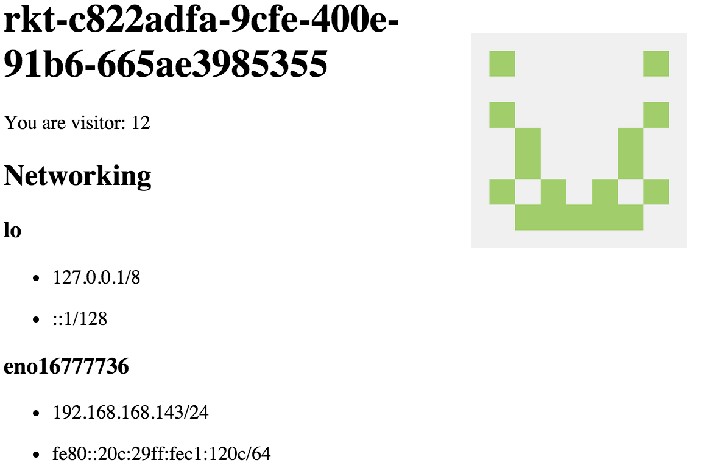

## Simple Host Info

[](https://quay.io/repository/philips/host-info)

Host info generates a unique looking page for every instance of the application inoder to make it easy to demo the scaling properties of Kubernetes. The goal is to have something that is small and easy to run while being visually easy to distinguish.

```
kubectl run --image=quay.io/philips/host-info:latest host-info
kubectl expose deployment host-info --session-affinity=None --port 8080
```

```
kubectl proxy
```

Visit http://localhost:8001/api/v1/proxy/namespaces/default/services/host-info/

```
kubectl scale --replicas=5 deployment/host-info
```



